# TicketYa – Diagramas (Entrega 1)

Todos los diagramas están escritos en [Mermaid](https://mermaid.js.org/) y GitHub los dibuja directamente en esta página. Reflejan el contrato (`openapi.yaml`), las historias de usuario y las decisiones de `arquitectura.md`.

Índice: [1. Arquitectura](#1-arquitectura) · [2. Modelo de datos](#2-modelo-de-datos) · [3. Estados](#3-estados) · [4. Secuencias](#4-secuencias)

---

## 1. Arquitectura

Los clientes hablan solo con el API Gateway. Cada servicio tiene su propia base de datos y los servicios se llaman entre sí por REST, solo por las rutas `/internal/**`, que el gateway no expone.

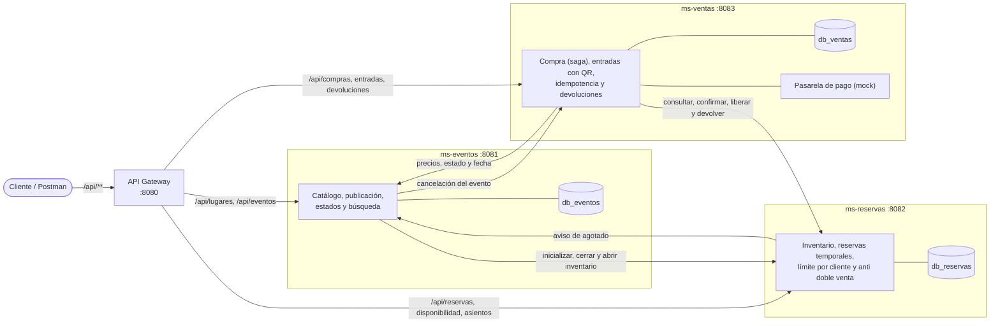
```mermaid
flowchart LR
    C([Cliente / Postman])
    GW["API Gateway<br/>:8080"]

    subgraph EV["ms-eventos :8081"]
        EVS["Catálogo, publicación,<br/>estados y búsqueda"]
        EVDB[("db_eventos")]
        EVS --- EVDB
    end

    subgraph RS["ms-reservas :8082"]
        RSS["Inventario, reservas temporales,<br/>límite por cliente y anti doble venta"]
        RSDB[("db_reservas")]
        RSS --- RSDB
    end

    subgraph VT["ms-ventas :8083"]
        VTS["Compra (saga), entradas con QR,<br/>idempotencia y devoluciones"]
        VTDB[("db_ventas")]
        PG["Pasarela de pago (mock)"]
        VTS --- VTDB
        VTS --- PG
    end

    C -->|"/api/**"| GW
    GW -->|"/api/lugares, /api/eventos"| EVS
    GW -->|"/api/reservas, disponibilidad, asientos"| RSS
    GW -->|"/api/compras, entradas, devoluciones"| VTS

    EVS -->|"inicializar, cerrar y abrir inventario"| RSS
    EVS -->|"cancelación del evento"| VTS
    RSS -->|"aviso de agotado"| EVS
    VTS -->|"consultar, confirmar, liberar y devolver"| RSS
    VTS -->|"precios, estado y fecha"| EVS
```

---

## 2. Modelo de datos

Una base por servicio; entre servicios no hay claves foráneas, solo referencias lógicas por id. Se muestran las columnas principales; el detalle completo está en las entidades JPA y en `modelo-datos.md`.

### 2.1 ms-eventos (`db_eventos`)

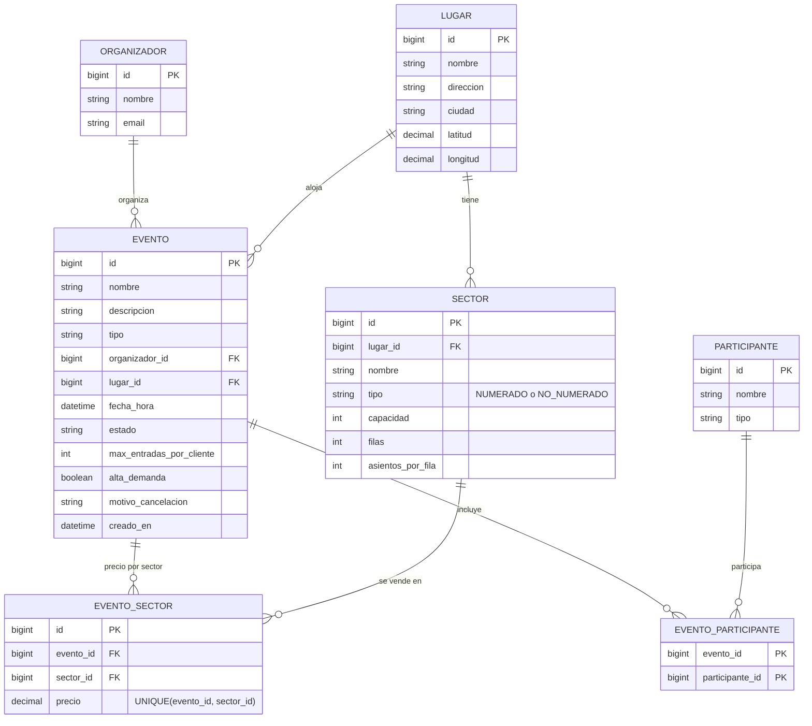
```mermaid
erDiagram
    ORGANIZADOR ||--o{ EVENTO : organiza
    LUGAR ||--o{ SECTOR : tiene
    LUGAR ||--o{ EVENTO : aloja
    EVENTO ||--o{ EVENTO_SECTOR : "precio por sector"
    SECTOR ||--o{ EVENTO_SECTOR : "se vende en"
    EVENTO ||--o{ EVENTO_PARTICIPANTE : incluye
    PARTICIPANTE ||--o{ EVENTO_PARTICIPANTE : participa

    ORGANIZADOR {
        bigint id PK
        string nombre
        string email
    }
    LUGAR {
        bigint id PK
        string nombre
        string direccion
        string ciudad
        decimal latitud
        decimal longitud
    }
    SECTOR {
        bigint id PK
        bigint lugar_id FK
        string nombre
        string tipo "NUMERADO o NO_NUMERADO"
        int capacidad
        int filas
        int asientos_por_fila
    }
    EVENTO {
        bigint id PK
        string nombre
        string descripcion
        string tipo
        bigint organizador_id FK
        bigint lugar_id FK
        datetime fecha_hora
        string estado
        int max_entradas_por_cliente
        boolean alta_demanda
        string motivo_cancelacion
        datetime creado_en
    }
    EVENTO_SECTOR {
        bigint id PK
        bigint evento_id FK
        bigint sector_id FK
        decimal precio "UNIQUE(evento_id, sector_id)"
    }
    PARTICIPANTE {
        bigint id PK
        string nombre
        string tipo
    }
    EVENTO_PARTICIPANTE {
        bigint evento_id PK
        bigint participante_id PK
    }
```

### 2.2 ms-reservas (`db_reservas`)

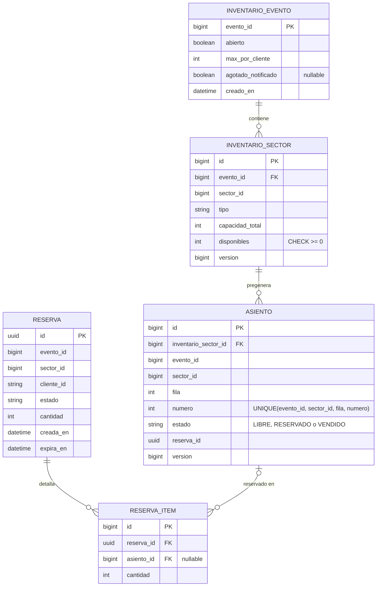
```mermaid
erDiagram
    INVENTARIO_EVENTO ||--o{ INVENTARIO_SECTOR : contiene
    INVENTARIO_SECTOR ||--o{ ASIENTO : "pregenera"
    RESERVA ||--o{ RESERVA_ITEM : detalla
    ASIENTO |o--o{ RESERVA_ITEM : "reservado en"

    INVENTARIO_EVENTO {
        bigint evento_id PK
        boolean abierto
        int max_por_cliente
        boolean agotado_notificado "nullable"
        datetime creado_en
    }
    INVENTARIO_SECTOR {
        bigint id PK
        bigint evento_id FK
        bigint sector_id
        string tipo
        int capacidad_total
        int disponibles "CHECK >= 0"
        bigint version
    }
    ASIENTO {
        bigint id PK
        bigint inventario_sector_id FK
        bigint evento_id
        bigint sector_id
        int fila
        int numero "UNIQUE(evento_id, sector_id, fila, numero)"
        string estado "LIBRE, RESERVADO o VENDIDO"
        uuid reserva_id
        bigint version
    }
    RESERVA {
        uuid id PK
        bigint evento_id
        bigint sector_id
        string cliente_id
        string estado
        int cantidad
        datetime creada_en
        datetime expira_en
    }
    RESERVA_ITEM {
        bigint id PK
        uuid reserva_id FK
        bigint asiento_id FK "nullable"
        int cantidad
    }
```

### 2.3 ms-ventas (`db_ventas`)

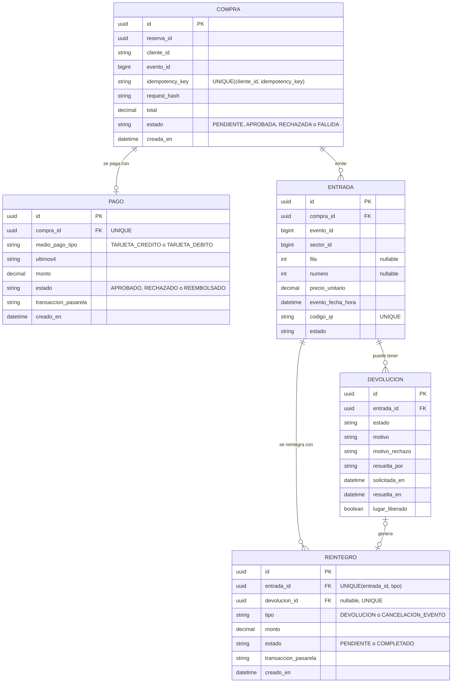
```mermaid
erDiagram
    COMPRA ||--o| PAGO : "se paga con"
    COMPRA ||--o{ ENTRADA : emite
    ENTRADA ||--o{ DEVOLUCION : "puede tener"
    ENTRADA ||--o{ REINTEGRO : "se reintegra con"
    DEVOLUCION |o--o| REINTEGRO : genera

    COMPRA {
        uuid id PK
        uuid reserva_id
        string cliente_id
        bigint evento_id
        string idempotency_key "UNIQUE(cliente_id, idempotency_key)"
        string request_hash
        decimal total
        string estado "PENDIENTE, APROBADA, RECHAZADA o FALLIDA"
        datetime creada_en
    }
    PAGO {
        uuid id PK
        uuid compra_id FK "UNIQUE"
        string medio_pago_tipo "TARJETA_CREDITO o TARJETA_DEBITO"
        string ultimos4
        decimal monto
        string estado "APROBADO, RECHAZADO o REEMBOLSADO"
        string transaccion_pasarela
        datetime creado_en
    }
    ENTRADA {
        uuid id PK
        uuid compra_id FK
        bigint evento_id
        bigint sector_id
        int fila "nullable"
        int numero "nullable"
        decimal precio_unitario
        datetime evento_fecha_hora
        string codigo_qr "UNIQUE"
        string estado
    }
    DEVOLUCION {
        uuid id PK
        uuid entrada_id FK
        string estado
        string motivo
        string motivo_rechazo
        string resuelta_por
        datetime solicitada_en
        datetime resuelta_en
        boolean lugar_liberado
    }
    REINTEGRO {
        uuid id PK
        uuid entrada_id FK "UNIQUE(entrada_id, tipo)"
        uuid devolucion_id FK "nullable, UNIQUE"
        string tipo "DEVOLUCION o CANCELACION_EVENTO"
        decimal monto
        string estado "PENDIENTE o COMPLETADO"
        string transaccion_pasarela
        datetime creado_en
    }
```

### 2.4 Referencias lógicas entre servicios

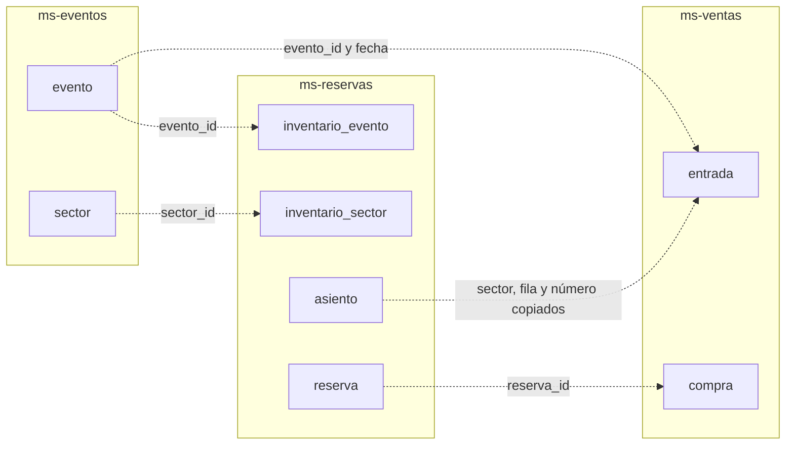
```mermaid
flowchart LR
    subgraph EV["ms-eventos"]
        E1[evento]
        E2[sector]
    end
    subgraph RS["ms-reservas"]
        R1[inventario_evento]
        R2[inventario_sector]
        R3[asiento]
        R4[reserva]
    end
    subgraph VT["ms-ventas"]
        V1[compra]
        V2[entrada]
    end

    E1 -.->|evento_id| R1
    E2 -.->|sector_id| R2
    R4 -.->|reserva_id| V1
    R3 -.->|"sector, fila y número copiados"| V2
    E1 -.->|"evento_id y fecha"| V2
```

---

## 3. Estados

### 3.1 Evento

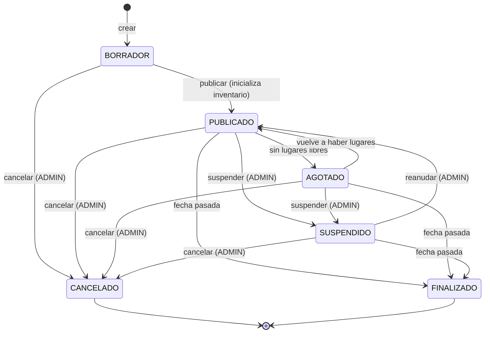
```mermaid
stateDiagram-v2
    [*] --> BORRADOR: crear
    BORRADOR --> PUBLICADO: publicar (inicializa inventario)
    PUBLICADO --> AGOTADO: sin lugares libres
    AGOTADO --> PUBLICADO: vuelve a haber lugares
    PUBLICADO --> SUSPENDIDO: suspender (ADMIN)
    AGOTADO --> SUSPENDIDO: suspender (ADMIN)
    SUSPENDIDO --> PUBLICADO: reanudar (ADMIN)
    BORRADOR --> CANCELADO: cancelar (ADMIN)
    PUBLICADO --> CANCELADO: cancelar (ADMIN)
    AGOTADO --> CANCELADO: cancelar (ADMIN)
    SUSPENDIDO --> CANCELADO: cancelar (ADMIN)
    PUBLICADO --> FINALIZADO: fecha pasada
    AGOTADO --> FINALIZADO: fecha pasada
    SUSPENDIDO --> FINALIZADO: fecha pasada
    CANCELADO --> [*]
    FINALIZADO --> [*]
```

### 3.2 Reserva

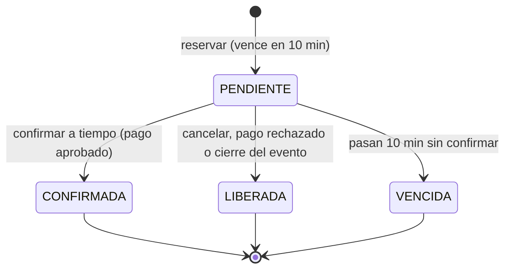
```mermaid
stateDiagram-v2
    [*] --> PENDIENTE: reservar (vence en 10 min)
    PENDIENTE --> CONFIRMADA: confirmar a tiempo (pago aprobado)
    PENDIENTE --> LIBERADA: cancelar, pago rechazado o cierre del evento
    PENDIENTE --> VENCIDA: pasan 10 min sin confirmar
    CONFIRMADA --> [*]
    LIBERADA --> [*]
    VENCIDA --> [*]
```

### 3.3 Asiento

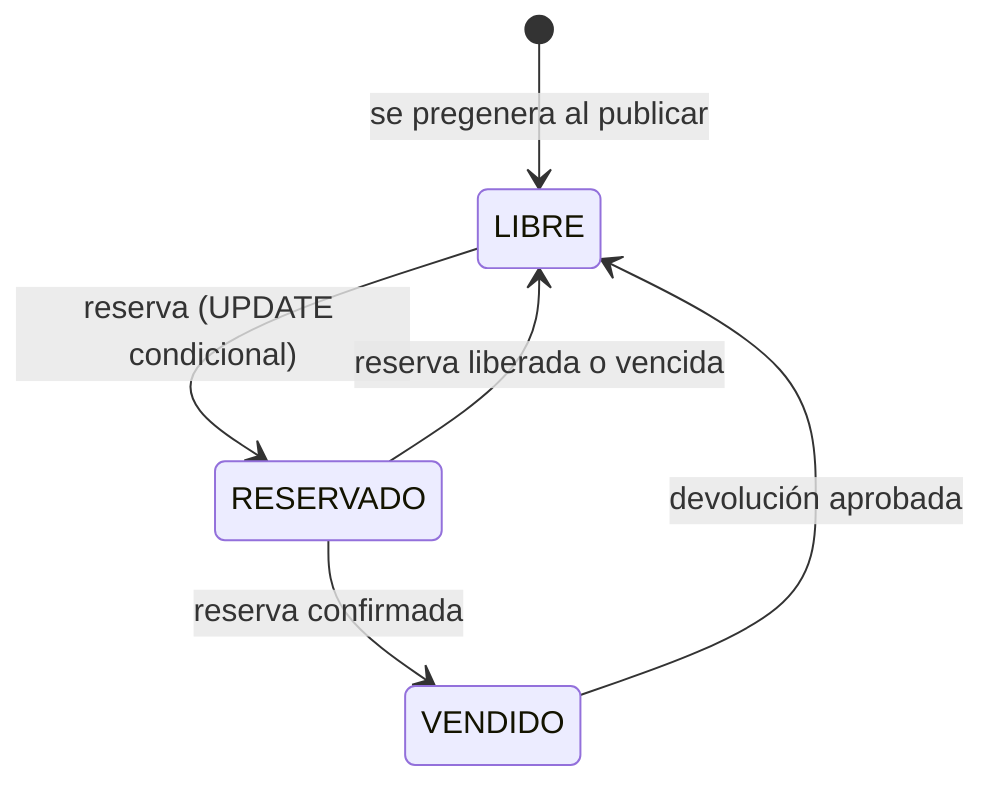
```mermaid
stateDiagram-v2
    [*] --> LIBRE: se pregenera al publicar
    LIBRE --> RESERVADO: reserva (UPDATE condicional)
    RESERVADO --> VENDIDO: reserva confirmada
    RESERVADO --> LIBRE: reserva liberada o vencida
    VENDIDO --> LIBRE: devolución aprobada
```

### 3.4 Compra

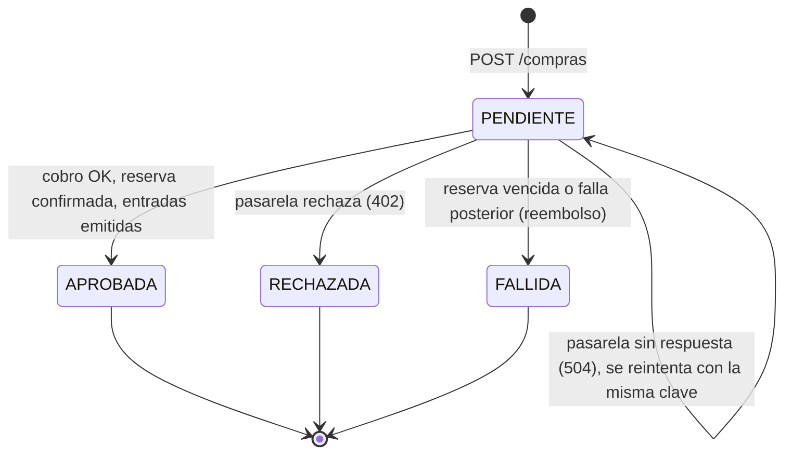
```mermaid
stateDiagram-v2
    [*] --> PENDIENTE: POST /compras
    PENDIENTE --> APROBADA: cobro OK, reserva confirmada, entradas emitidas
    PENDIENTE --> RECHAZADA: pasarela rechaza (402)
    PENDIENTE --> FALLIDA: reserva vencida o falla posterior (reembolso)
    PENDIENTE --> PENDIENTE: pasarela sin respuesta (504), se reintenta con la misma clave
    APROBADA --> [*]
    RECHAZADA --> [*]
    FALLIDA --> [*]
```

### 3.5 Entrada

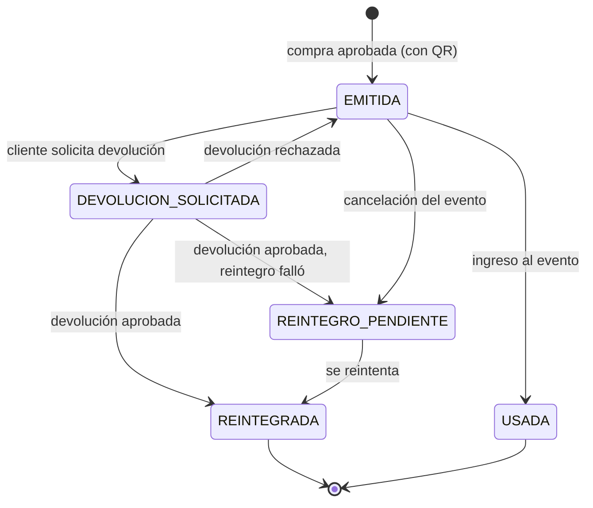
```mermaid
stateDiagram-v2
    [*] --> EMITIDA: compra aprobada (con QR)
    EMITIDA --> USADA: ingreso al evento
    EMITIDA --> DEVOLUCION_SOLICITADA: cliente solicita devolución
    DEVOLUCION_SOLICITADA --> EMITIDA: devolución rechazada
    DEVOLUCION_SOLICITADA --> REINTEGRO_PENDIENTE: devolución aprobada, reintegro falló
    DEVOLUCION_SOLICITADA --> REINTEGRADA: devolución aprobada
    REINTEGRO_PENDIENTE --> REINTEGRADA: se reintenta
    EMITIDA --> REINTEGRO_PENDIENTE: cancelación del evento
    REINTEGRADA --> [*]
    USADA --> [*]
```

### 3.6 Reintegro

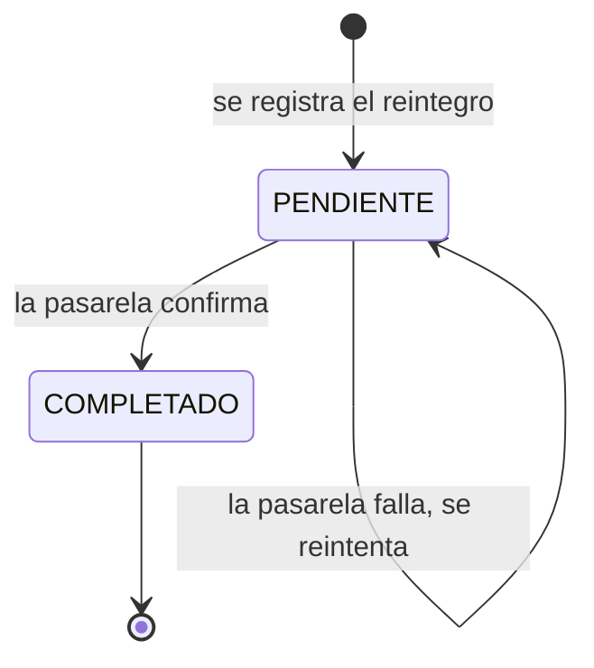
```mermaid
stateDiagram-v2
    [*] --> PENDIENTE: se registra el reintegro
    PENDIENTE --> COMPLETADO: la pasarela confirma
    PENDIENTE --> PENDIENTE: la pasarela falla, se reintenta
    COMPLETADO --> [*]
```

El reintegro de cada entrada es único por tipo (`DEVOLUCION` o `CANCELACION_EVENTO`), por eso repetir la operación no reintegra dos veces.

### 3.7 Devolución

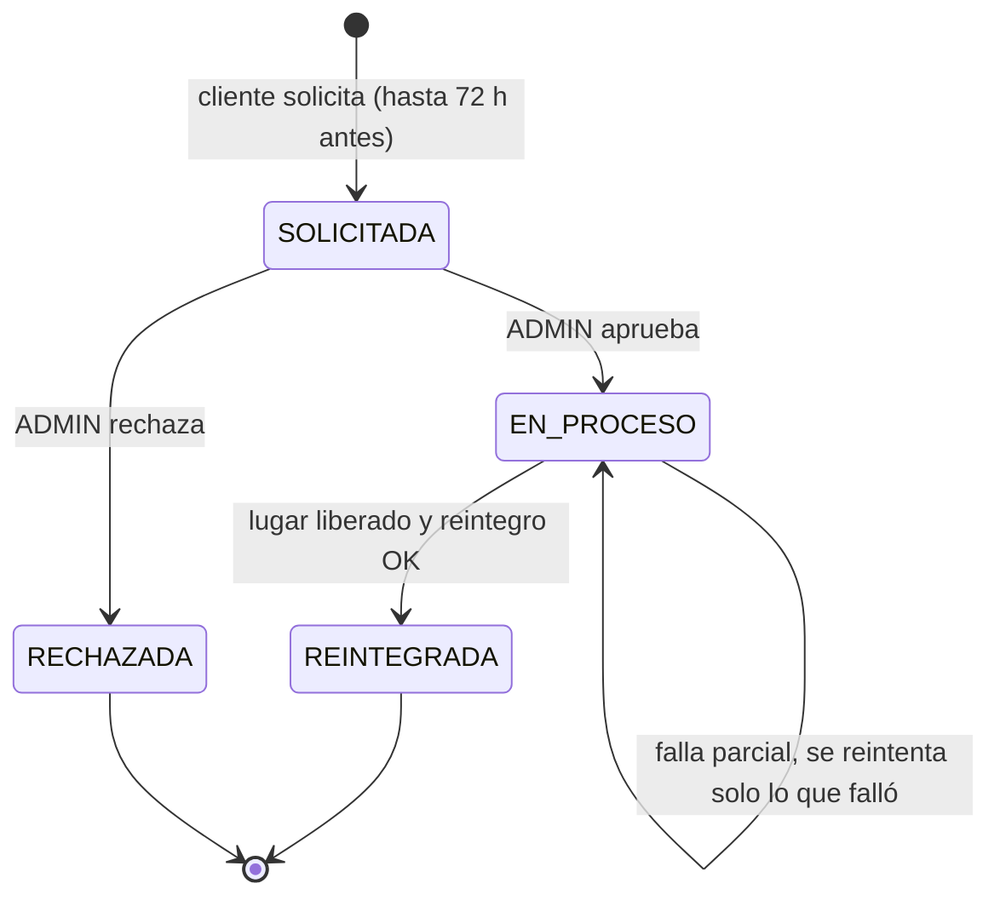
```mermaid
stateDiagram-v2
    [*] --> SOLICITADA: cliente solicita (hasta 72 h antes)
    SOLICITADA --> EN_PROCESO: ADMIN aprueba
    SOLICITADA --> RECHAZADA: ADMIN rechaza
    EN_PROCESO --> REINTEGRADA: lugar liberado y reintegro OK
    EN_PROCESO --> EN_PROCESO: falla parcial, se reintenta solo lo que falló
    REINTEGRADA --> [*]
    RECHAZADA --> [*]
```

---

## 4. Secuencias

### 4.1 Compra: reserva, pago y emisión de entradas

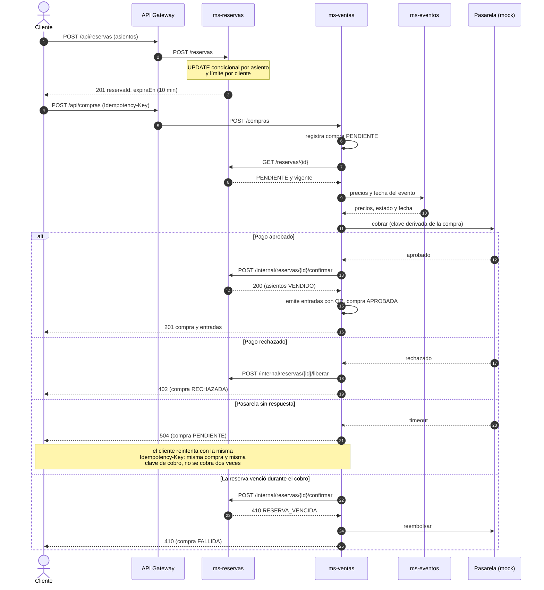
```mermaid
sequenceDiagram
    autonumber
    actor Cl as Cliente
    participant GW as API Gateway
    participant RS as ms-reservas
    participant VT as ms-ventas
    participant EV as ms-eventos
    participant PG as Pasarela (mock)

    Cl->>GW: POST /api/reservas (asientos)
    GW->>RS: POST /reservas
    Note over RS: UPDATE condicional por asiento<br/>y límite por cliente
    RS-->>Cl: 201 reservaId, expiraEn (10 min)

    Cl->>GW: POST /api/compras (Idempotency-Key)
    GW->>VT: POST /compras
    VT->>VT: registra compra PENDIENTE
    VT->>RS: GET /reservas/{id}
    RS-->>VT: PENDIENTE y vigente
    VT->>EV: precios y fecha del evento
    EV-->>VT: precios, estado y fecha
    VT->>PG: cobrar (clave derivada de la compra)

    alt Pago aprobado
        PG-->>VT: aprobado
        VT->>RS: POST /internal/reservas/{id}/confirmar
        RS-->>VT: 200 (asientos VENDIDO)
        VT->>VT: emite entradas con QR, compra APROBADA
        VT-->>Cl: 201 compra y entradas
    else Pago rechazado
        PG-->>VT: rechazado
        VT->>RS: POST /internal/reservas/{id}/liberar
        VT-->>Cl: 402 (compra RECHAZADA)
    else Pasarela sin respuesta
        PG--xVT: timeout
        VT-->>Cl: 504 (compra PENDIENTE)
        Note over Cl,VT: el cliente reintenta con la misma<br/>Idempotency-Key: misma compra y misma<br/>clave de cobro, no se cobra dos veces
    else La reserva venció durante el cobro
        VT->>RS: POST /internal/reservas/{id}/confirmar
        RS-->>VT: 410 RESERVA_VENCIDA
        VT->>PG: reembolsar
        VT-->>Cl: 410 (compra FALLIDA)
    end
```

### 4.2 Reserva que vence antes de pagar

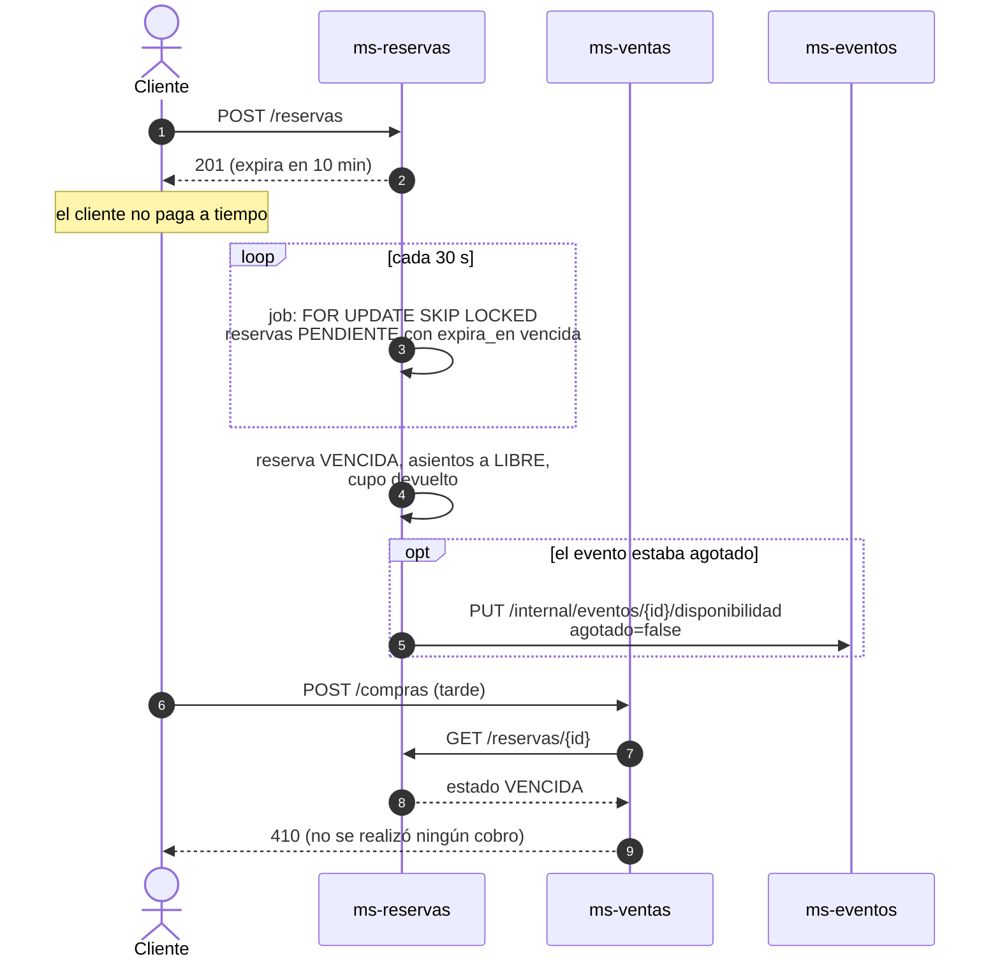
```mermaid
sequenceDiagram
    autonumber
    actor Cl as Cliente
    participant RS as ms-reservas
    participant VT as ms-ventas
    participant EV as ms-eventos

    Cl->>RS: POST /reservas
    RS-->>Cl: 201 (expira en 10 min)
    Note over Cl: el cliente no paga a tiempo
    loop cada 30 s
        RS->>RS: job: FOR UPDATE SKIP LOCKED<br/>reservas PENDIENTE con expira_en vencida
    end
    RS->>RS: reserva VENCIDA, asientos a LIBRE,<br/>cupo devuelto
    opt el evento estaba agotado
        RS->>EV: PUT /internal/eventos/{id}/disponibilidad<br/>agotado=false
    end
    Cl->>VT: POST /compras (tarde)
    VT->>RS: GET /reservas/{id}
    RS-->>VT: estado VENCIDA
    VT-->>Cl: 410 (no se realizó ningún cobro)
```

### 4.3 Dos clientes compiten por el mismo asiento

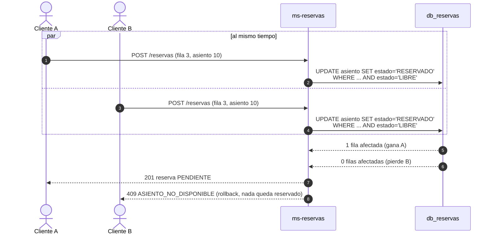
```mermaid
sequenceDiagram
    autonumber
    actor A as Cliente A
    actor B as Cliente B
    participant RS as ms-reservas
    participant DB as db_reservas

    par al mismo tiempo
        A->>RS: POST /reservas (fila 3, asiento 10)
        RS->>DB: UPDATE asiento SET estado='RESERVADO'<br/>WHERE ... AND estado='LIBRE'
    and
        B->>RS: POST /reservas (fila 3, asiento 10)
        RS->>DB: UPDATE asiento SET estado='RESERVADO'<br/>WHERE ... AND estado='LIBRE'
    end
    DB-->>RS: 1 fila afectada (gana A)
    DB-->>RS: 0 filas afectadas (pierde B)
    RS-->>A: 201 reserva PENDIENTE
    RS-->>B: 409 ASIENTO_NO_DISPONIBLE (rollback, nada queda reservado)
```

### 4.4 Devolución de una entrada

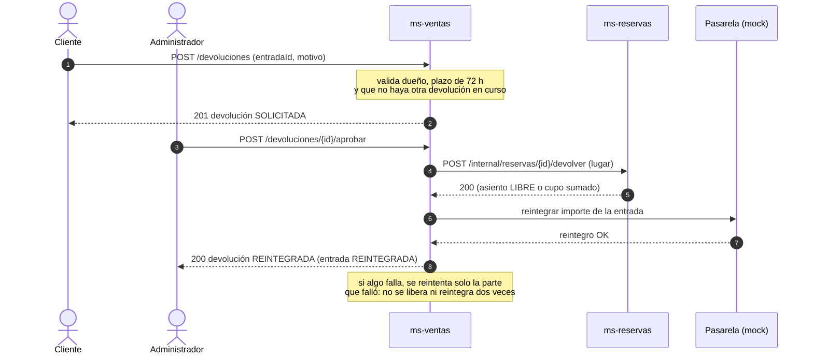
```mermaid
sequenceDiagram
    autonumber
    actor Cl as Cliente
    actor Ad as Administrador
    participant VT as ms-ventas
    participant RS as ms-reservas
    participant PG as Pasarela (mock)

    Cl->>VT: POST /devoluciones (entradaId, motivo)
    Note over VT: valida dueño, plazo de 72 h<br/>y que no haya otra devolución en curso
    VT-->>Cl: 201 devolución SOLICITADA

    Ad->>VT: POST /devoluciones/{id}/aprobar
    VT->>RS: POST /internal/reservas/{id}/devolver (lugar)
    RS-->>VT: 200 (asiento LIBRE o cupo sumado)
    VT->>PG: reintegrar importe de la entrada
    PG-->>VT: reintegro OK
    VT-->>Ad: 200 devolución REINTEGRADA (entrada REINTEGRADA)
    Note over VT: si algo falla, se reintenta solo la parte<br/>que falló: no se libera ni reintegra dos veces
```

### 4.5 Cancelación del evento y reintegros

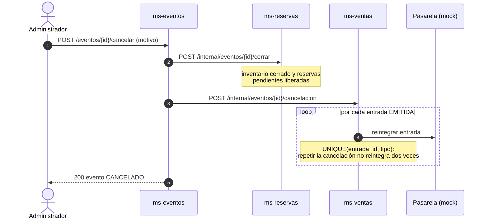
```mermaid
sequenceDiagram
    autonumber
    actor Ad as Administrador
    participant EV as ms-eventos
    participant RS as ms-reservas
    participant VT as ms-ventas
    participant PG as Pasarela (mock)

    Ad->>EV: POST /eventos/{id}/cancelar (motivo)
    EV->>RS: POST /internal/eventos/{id}/cerrar
    Note over RS: inventario cerrado y reservas<br/>pendientes liberadas
    EV->>VT: POST /internal/eventos/{id}/cancelacion
    loop por cada entrada EMITIDA
        VT->>PG: reintegrar entrada
        Note over VT: UNIQUE(entrada_id, tipo):<br/>repetir la cancelación no reintegra dos veces
    end
    EV-->>Ad: 200 evento CANCELADO
```
